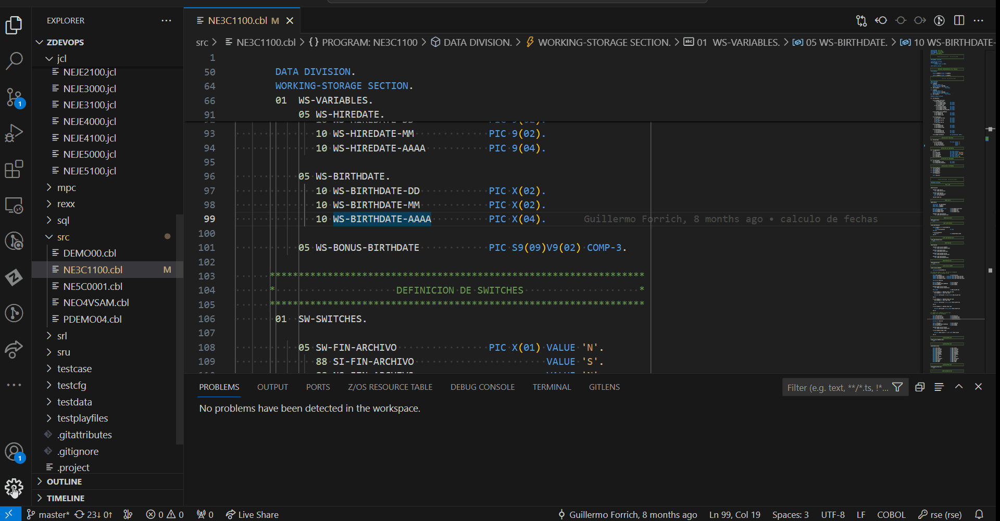
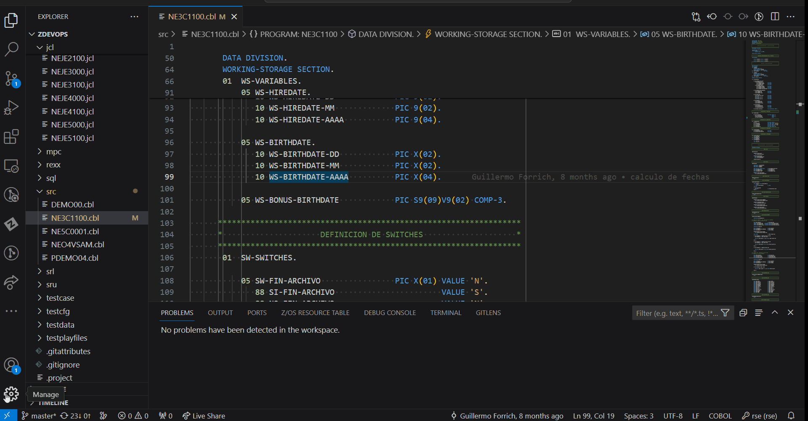

# CBL Linter Extension for z/OS

This extension is designed to assist developers with code in COBOL by highlighting potential errors and warnings in the code and offering possible fixes through quick-fix actions.

## Table of contents

- [CBL Linter Extension for z/OS](#cbl-linter-extension-for-zos)
  - [Table of contents](#table-of-contents)
    - [Types of rules](#types-of-rules)
    - [Quick fix actions](#quick-fix-actions)
    - [Enable/disable linter](#enabledisable-linter)

### Types of rules

The messages showed by the CBL linter are of two types:
  
  - Error
  - Warning

  Clearly, the type of messages is determined by the severity of the rules. 

- Error:
  - The error is indicated by a red line beneath the line containing the error. Placing the cursor on this line will display the corresponding error message.

- Warning:
  - The warning is indicated by a red line beneath the line containing the warning. Placing the cursor on this line will display the corresponding warning message

### Quick fix actions

- If a problem (error/warning) is identified and shows a quick fix action, simply clicking on it will resolve the issue.

- Just put the cursor on the error/warning message. If a quick action is available, simply click on 'Quick Fix... (Ctrl+.)', and the quick fix actions will be shown. There could be more than one action.

### Enable/disable linter

The Linter mode can be enabled by default from settings, but anyway, it can be activated and disabled from normal menu.

- Enable linter from settings:

  By default, opened text editors are not checked by the cobol linter

  With these steps you can enable it

  Then, each time you open a valid file, it will be checked automatically by the linter

- Enable/disable linter from commands menu:

  - Right-click to open the commands menu -> click on the Activate linter/Deactivate linter option